**Thilina Ratnayake**

**COMP 8505**

**A3**

**\
**

Table of Contents

Introduction
============

Backsniffer is a covert communication suite that allows communication
between an attacker and a backdoor application on a target’s compromised
machine.

Backsniffer contains two modules:

1.  Blackhat.py – This is the module that sends commands to the target
    and waits for replies.

2.  Client.py – The actual “Back-Door” that can be run on the
    client machine.

Features:
---------

Some features of the Backsniffer suite include:

-   **Firewall Evasion:**\
    Commands are able to get through to the target machine even with a
    running firewall due to the use of raw-sockets to sniff for packets.

-   **Process Masking:\
    **The back-door module running on the client’s machine can
    camouflage itself by changing the name of it’s process. This allows
    it to remain invisible through usual detection methods such as
    running ‘ps aux’.

-   **Authentication\
    **By checking for a pre-determined TTL and destination port, there
    are two layers of authentication to ensure that the backdoor only
    picks up messages that are meant for it.

-   **AES 256 Bit Encryption\
    **All messages sent between the client and backdoor are encrypted
    using AES 256 bit encryption to mitigate any chance of easy
    discovery via packet captures.

Full assignment documentation including psuedocode, code listings & testing can be found in the docs folder

----------
Features
-----------
 - **Firewall Evasion** Commands are able to get through to the target machine even with a running firewall due to the use of raw-sockets to sniff for packets.
 - **Process Masking** The back-door module running on the client’s machine can camouflage itself by changing the name of it’s process. This allows it to remain invisible through usual detection methods such as running ‘ps aux’.
 - **Authentication** By checking for a pre-determined TTL and destination port, there are two layers of authentication to ensure that the backdoor only picks up messages that are meant for it.
 - **AES 256 Bit Encryption** All messages sent between the client and backdoor are encrypted using AES 256 bit encryption to mitigate any chance of easy discovery via packet captures.

Practical Application
---------------------

A typical scenario for this application would be uploading and executing
the client.py application on a target machine via an entry vector of
ones choice (social-engineering etc)

Once run, the backdoor will disguise its-self with a process name as set
by the attacker so as to evade detection on any process lists. After it
has masked its process name, it will listen on raw sockets for packets
from the attackers, which match a specific signature. The signature is a
combination of 2 facts, the IP header’s TTL and destination port it is
being received on. As mentioned above, this ensures that messages get
through any personal firewall that is running on the compromised system.

Packets then get decrypted using a pre-shared decryption key producing
the command which is executed and sent back using the same encryption
sequence. This allows an attacker to virtually have a remote shell on a
compromised system.

Usage
=====

Requirements:
-------------

1.  Backsniffer requires that the following python libraries be
    installed

    a.  PyCrypto

    b.  Setproctitle

    c.  Scapy

2.  This can all be installed by running the shell script:

    a.  sh startup.sh**\
        **

Sending & Receiving Data
------------------------

1.  *Starting the backdoor.*

    On the target machine, enter command: **python client.py 80 71
    012345689abcdef abcdefghijklmnop \[KWorker2:0\]**

    The first two arguments that we are listening for packets that have
    the characteristics: (1) incoming to port 80 and (2) have a TTL
    of 71. This is the criteria to specify that the packets are from
    the attacker.

    Secondly, we then enter in our pre-shared encryption key and
    initialization vectors. These two parameters allows us to decrypt
    and encrypt the messages between attacker and victim.

    We instruct the backdoor to start-up with the process
    name “\[KWorker2:0\]”. This is because on our test systems, there
    are multiple kworker\*:\* processes running at any given time, and
    choosing the name specified will be able to easily mask the process.
    The first two letters have been highlighted to be able to recognize
    the process in order to kill it later.

2.  *Starting the attacker’s shell.\
    *On the attackers machine, enter command: **python blackhat.py
    192.168.0.3 500 80 71 0123456789abcdef abcdefghijklmnop\
    \
    **After the connection info has been entered, the attacker can
    simply begin entering in commands as if he or she were utilizing a
    shell on the victims machine.

Results
=======

After running tests and experiments, the results show that Backsniffer
is able to:

-   Send encrypted messages between the two systems.

-   Execute commands on the client machine and send the output back.

-   Evade a firewall that is dropping all packets.

Diagrams 
=========

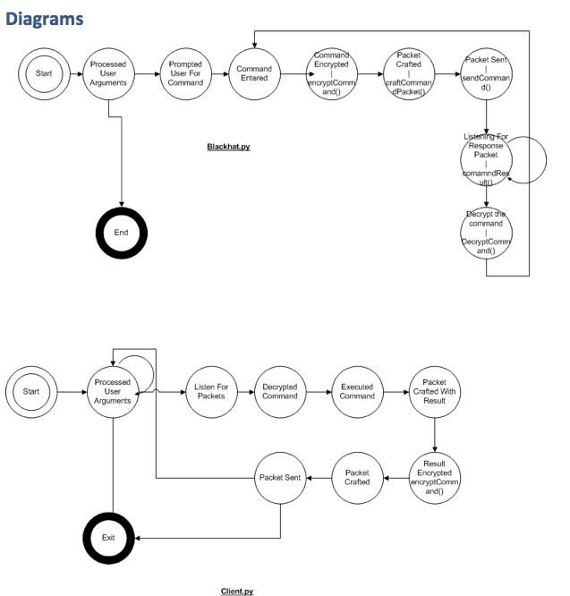

Code Listings
=============

The Backsniffer application is split up into two modules:

1.  Blackhat.py – This is the module that sends commands to the target
    and waits for replies.

2.  Client.py – The actual “Back-Door” that can be run on the
    client machine.

Psuedocode
==========

### Blackhat.py:

1.  Take command line arguments

2.  Prompt use for message

3.  Encrypt message

4.  Craft packet to with source port, destination port, and ttl
    specified in step 1

5.  Send Packet

6.  Listen for a response from the client

7.  Decrypt the received packet

8.  Display the result

### Client.py:

1.  Take command line arguments

2.  Set process title to what is specified in 1

3.  Listen on the port specified in 1

4.  For each packet received on that packet, check it against the
    signature specified in 1 (ttl and src port)

    a.  If a packet matches the signatures

        i.  Decrypt the command from packet

        ii. Run command

        iii. Get output

        iv. Craft a packet destined for the source that the incoming
            packet came from.

        v.  Encrypt result

        vi. Put result into packet

        vii. Send packet

5.  Listen for new packets

Tests
=====
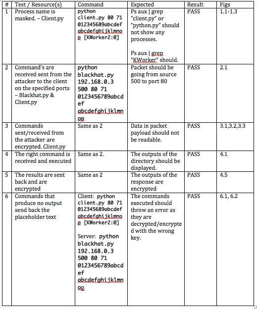
Figures & Tests
===============

*Test 1*

This test was to check that the backdoor program on the victims machine
is able to successfully mask it’s process name. In this case, to
\[KWorker2:0\] as set in the command line arguments.

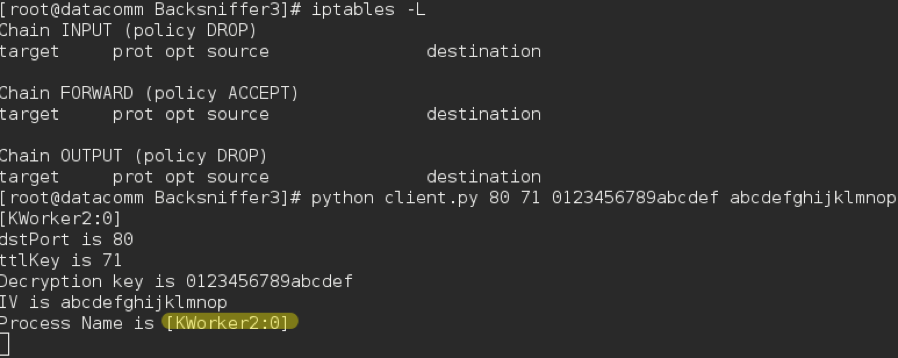

Fig 1.1 – Client output after backdoor has been started.

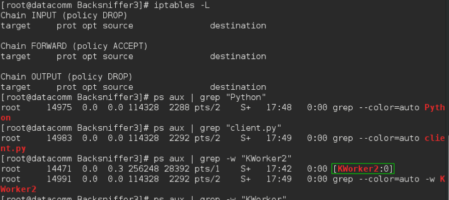

Fig 1.2- Client terminal showing that the process is not shown as
client.py or as a python script. Client process is “KWorker2:0” as
specified in the initial command.

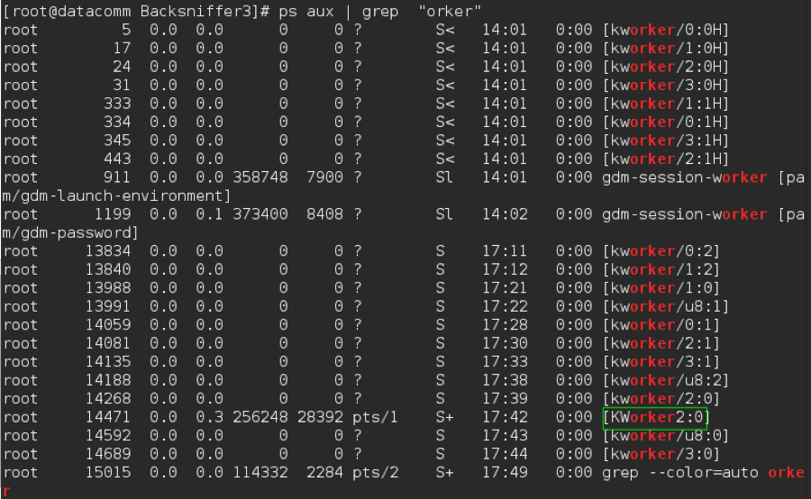

Fig 1.3 – Terminal displayed shows all other running KWorker threads.
This puts into perspective what it would be like for a user or analyst
viewing currently open processes.

*Test 2*

This test was to check whether packets sent from the attacker to the
victim were being sent to and from the correct ports. Specifically, from
source port 500 to destination port 80 as per command line arguments.

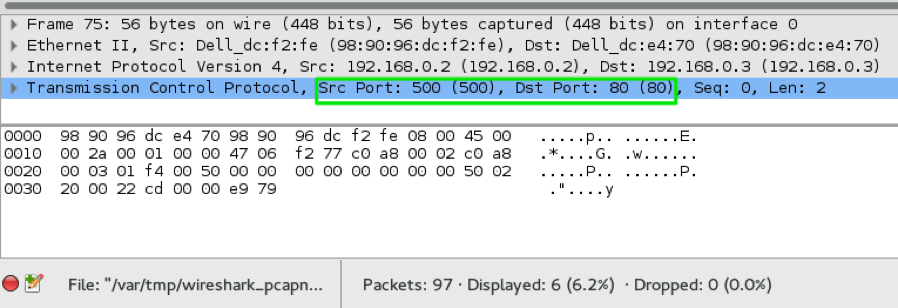

Fig 2.1 – The packets are being sent from the right source port to the
right destination port

*Test 3*

This test was to check that the messages being sent between attacker and
victim are encrypted and can’t be read via an analyst viewing packet
captures.

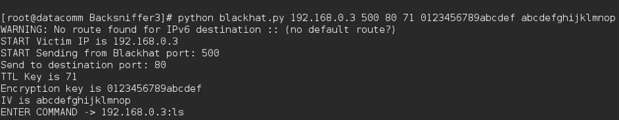

Fig 3.1 – Terminal Output showing the command that the attacker has
sent.

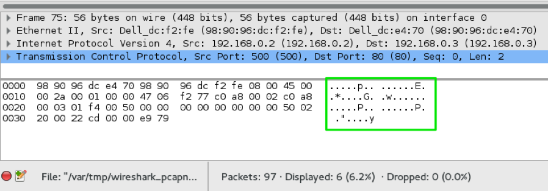

Fig 3.2 – The Wireshark capture at the attacker showing that the
packet’s data is not in plain-text.

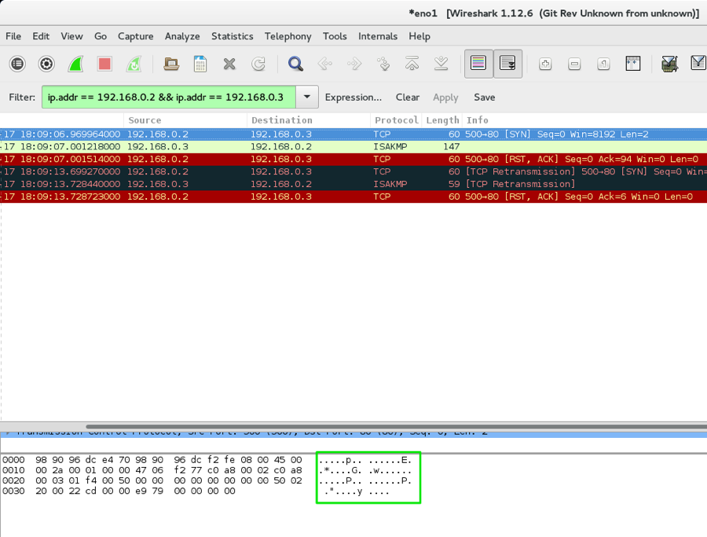Fig 3.3 – The Wireshark capture at the client
showing that the received packet is encrypted after being in transit.

*Test 4 & 5:*

This test checks to see whether the command is being executed on the
victims system and whether results are being sent back. Figure 4.5 is
part of Test 5 which shows that messages from the victim to the attacker
are encrypted as well.

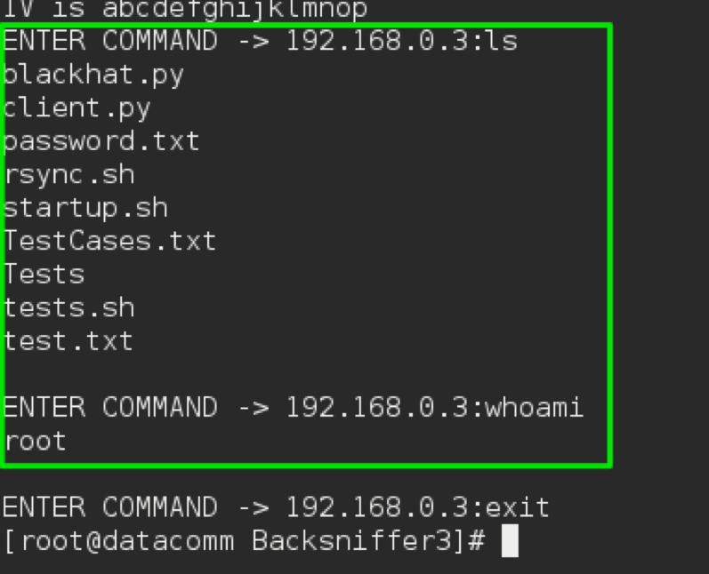

Fig 4.1 – Results are sent back.

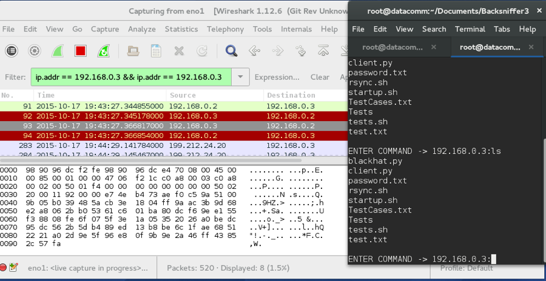

Fig 4.5 – The result coming back is encrypted

*Test 6*

This test shows the results of the attacker or victim using incorrect
encryption/decryption keys & Initialization Vector. If one party does
not use the right key, then the commands interpreted and results sent
back will be different.\
\
It can be seen in the screenshots that the attacker uses initialization
vector “abcdefghijklmno***p***” whereas the victim uses
“abcdefghijklmno***q***” . This leads to a different result when
decrypted, which explains the output seen in Fig 6.2

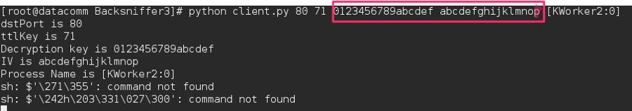

Fig 6.1 – Client: Backdoor start with different key.

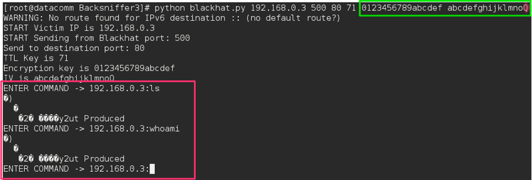

Fig 6.2 – Attacker: The result is wrong if the wrong encryption keys and
decryption keys are specified
